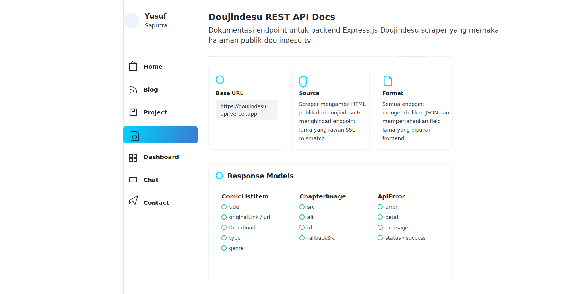

<!-- GitAds-Verify: DBW8G884X4K725U9YJY8NEG65BPFJJKJ -->

Personal website built with Next.js, TypeScript, and Tailwind CSS.

## Doujindesu API Docs



Open the docs:
[https://vernsg.is-a.dev/doujindesu-api-docs](https://vernsg.is-a.dev/doujindesu-api-docs)

API base URL:

```txt
https://doujindesu-rest-api.vercel.app
```

Quick test:

```bash
curl https://doujindesu-rest-api.vercel.app/terbaru
curl https://doujindesu-rest-api.vercel.app/detail-komik/arasau-dokushin-josei-kyoushi-wa-shishunki-danshi-nanka-yori-tamatten-dayo
curl https://doujindesu-rest-api.vercel.app/baca-chapter/arasau-dokushin-josei-kyoushi-wa-shishunki-danshi-nanka-yori-tamatten-dayo/1
```

## Local Development

```bash
npm install
npm run dev
```

Then open:

```txt
http://localhost:3000/doujindesu-api-docs
```

## Doujindesu Cookie

This API renders Doujindesu pages with Playwright, then parses the rendered HTML with Cheerio. Playwright is used because Doujindesu can block plain Axios requests with Cloudflare.

Playwright scraping is not recommended on Vercel serverless due to browser binary and runtime limits. Render, Railway, Fly.io, or a VPS are better fits for this API.

Doujindesu may still protect pages with Cloudflare. If scraping returns a Cloudflare error, add a browser cookie to `.env`:

```env
DOUJINDESU_COOKIE=
```

How to get the cookie:

1. Open `https://doujindesu.tv` in your browser.
2. Open DevTools and inspect cookies for `doujindesu.tv`.
3. Copy the cookie string, including `cf_clearance` when Cloudflare asks for verification.
4. Paste it into `.env` as `DOUJINDESU_COOKIE=...`.
5. Restart the API server after changing `.env`.

Do not commit `.env`. Cookies can expire, so repeat the steps when requests start failing again. Cookies without `cf_clearance` are ignored by the Playwright context because partial anti-bot cookies can break the reader AJAX response.

Quick local test:

```bash
curl http://localhost:3001/api/doujin
curl http://localhost:3001/api/manga
curl http://localhost:3001/api/detail/amaama-downer-gal-wa-yasashiku-tsutsumikomu
```
